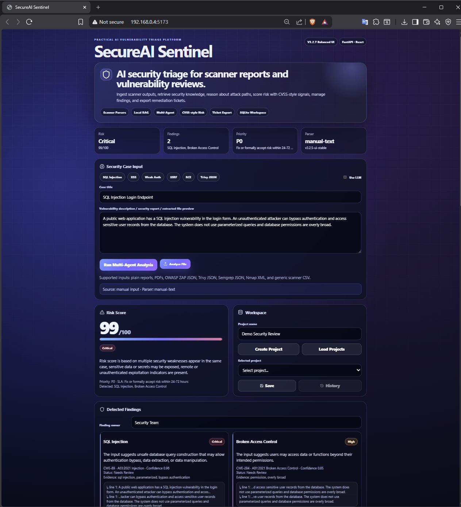
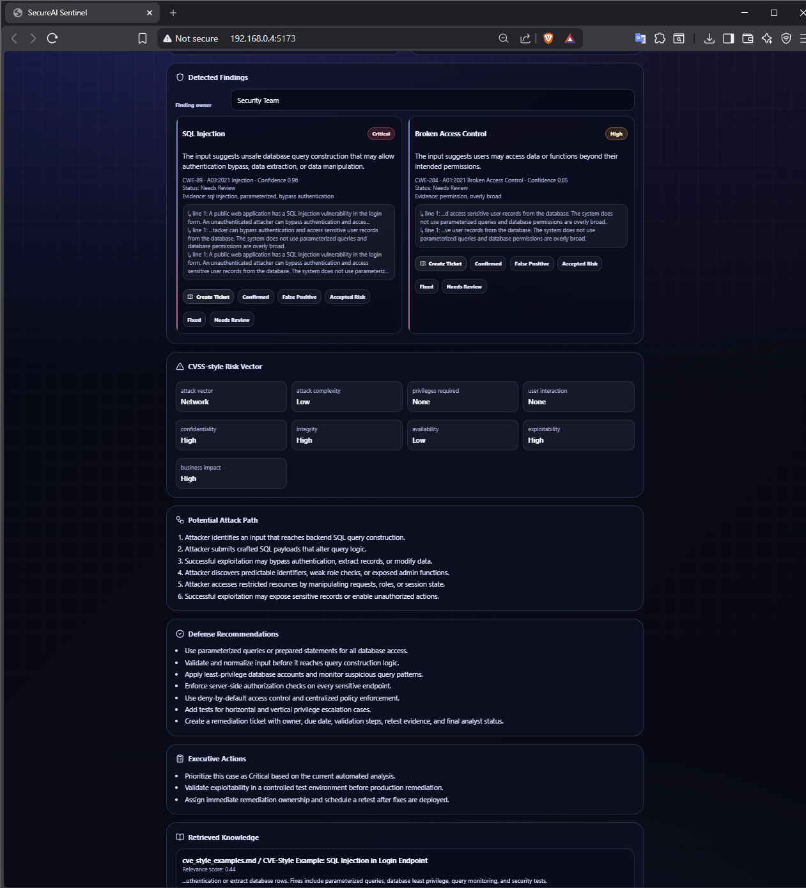
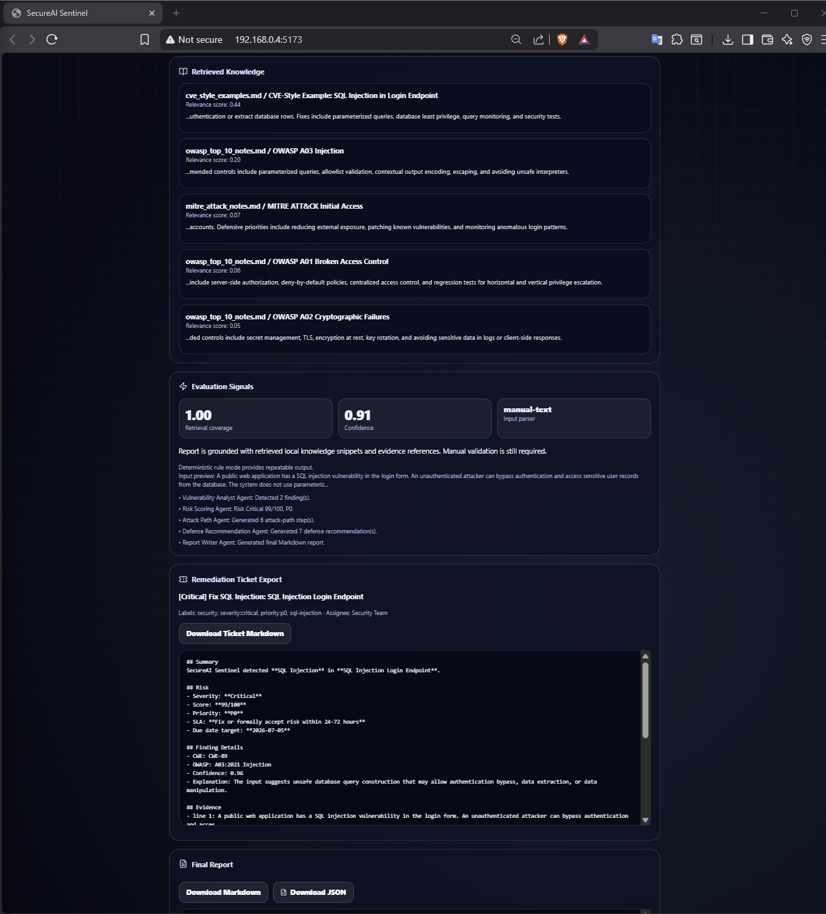
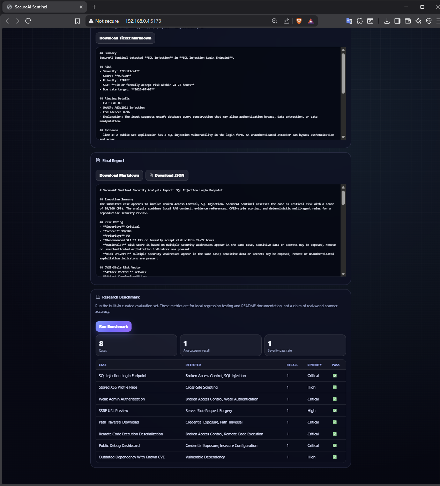

# SecureAI Sentinel

**SecureAI Sentinel** is an AI-assisted vulnerability triage and remediation platform built with **FastAPI**, **React**, local RAG, scanner report parsers, CVSS-style risk scoring, workspace storage, and remediation ticket export.

It converts raw vulnerability descriptions and scanner outputs into structured security findings, risk scores, attack paths, mitigation plans, analyst workflow statuses, and exportable security reports.

> **Status:** Stable practical portfolio version. This is an AI-assisted security triage prototype, not a replacement for qualified security review.

---

## Demo Workflow

```text
Security text / PDF / scanner report
        ↓
Parser and scanner normalizer
        ↓
Evidence extraction
        ↓
Local RAG cybersecurity knowledge retrieval
        ↓
Multi-agent analysis pipeline
        ↓
Risk score + CVSS-style vector + priority/SLA
        ↓
Attack path + defense recommendations
        ↓
Markdown/JSON report + remediation ticket
        ↓
SQLite workspace history and finding status tracking
```

---

## Key Features

### AI Security Analysis

- Multi-agent workflow:
  - Vulnerability Analyst Agent
  - Risk Scoring Agent
  - Attack Path Agent
  - Defense Recommendation Agent
  - Report Writer Agent
- Local RAG retrieval over cybersecurity notes.
- Optional LLM mode through OpenAI-compatible or Ollama-compatible endpoints.
- Evidence-grounded analysis to reduce hallucination risk.
- Deterministic fallback mode for repeatable demo results.

### Practical Scanner Ingestion

Supported input types:

- Plain text reports
- Markdown and log files
- PDF reports
- JSON reports
- XML reports
- CSV reports

Built-in parser support:

- OWASP ZAP JSON
- Trivy JSON
- Semgrep JSON
- Nmap XML
- Generic vulnerability CSV
- Generic JSON/XML fallback

Sample scanner reports are included in:

```text
samples/
```

### Risk Triage and Analyst Workflow

- CVSS-style risk vector:
  - Attack Vector
  - Attack Complexity
  - Privileges Required
  - User Interaction
  - Confidentiality, Integrity, Availability impact
  - Exploitability
  - Business Impact
- Priority mapping: P0, P1, P2, P3.
- Recommended remediation SLA.
- Finding status workflow:
  - Needs Review
  - Confirmed
  - False Positive
  - Accepted Risk
  - Fixed
- Remediation ticket export as Markdown.
- SQLite workspace with saved analysis history.

### Reporting and Evaluation

- Markdown report export.
- JSON result export.
- Internal benchmark for regression testing.
- Evaluation signals:
  - Retrieval coverage
  - Confidence
  - Input parser type
  - Agent trace summaries

> **Benchmark note:** the included benchmark is a small curated regression suite for project validation. It is not a claim of real-world scanner accuracy.

---

## Tech Stack

| Layer | Technology |
|---|---|
| Backend | Python, FastAPI, Pydantic |
| Frontend | React, Vite, CSS |
| Retrieval | Local TF-IDF RAG with scikit-learn |
| Storage | SQLite |
| Parsing | JSON, CSV, XML, PDF parser |
| Optional LLM | OpenAI-compatible API or Ollama-compatible API |
| Deployment | Docker Compose |

---

## Project Structure

```text
secureai-sentinel/
├── backend/
│   ├── app/
│   │   ├── agents/          # analysis agents and rule engine
│   │   ├── evaluation/      # benchmark logic
│   │   ├── rag/             # local knowledge retrieval
│   │   ├── schemas/         # Pydantic models
│   │   ├── services/        # orchestrator, storage, tickets, LLM client
│   │   └── utils/           # file parser and text utilities
│   ├── data/knowledge_base/ # OWASP/MITRE/CVE-style local notes
│   ├── requirements.txt
│   └── run_benchmark.py
├── frontend/
│   ├── src/
│   │   ├── main.jsx
│   │   └── style.css
│   ├── package.json
│   └── index.html
├── samples/                 # sample scanner files
├── experiments/             # benchmark cases and results
├── docs/                    # architecture, report, demo, CV/SOP material
├── docker-compose.yml
└── README.md
```

---

## Quick Start

### 1. Clone the repository

```bash
git clone https://github.com/Zkp1-2/secureai-sentinel.git
cd secureai-sentinel
```

### 2. Run the backend

```bash
cd backend
python -m venv .venv
```

On **Windows PowerShell**:

```powershell
Set-ExecutionPolicy -Scope Process -ExecutionPolicy Bypass
.\.venv\Scripts\Activate.ps1
pip install -r requirements.txt
uvicorn app.main:app --reload --port 8000
```

If activation fails on Windows, run directly through the virtual environment:

```powershell
.\.venv\Scripts\python.exe -m pip install -r requirements.txt
.\.venv\Scripts\python.exe -m uvicorn app.main:app --reload --port 8000
```

On **macOS/Linux**:

```bash
source .venv/bin/activate
pip install -r requirements.txt
uvicorn app.main:app --reload --port 8000
```

The backend will run at:

```text
http://127.0.0.1:8000
```

### 3. Run the frontend

Open a second terminal:

```bash
cd frontend
npm install
npm run dev
```

The frontend will run at:

```text
http://127.0.0.1:5173
```

---

## Docker Compose

```bash
docker compose up --build
```

Backend: `http://127.0.0.1:8000`  
Frontend: `http://127.0.0.1:5173`

---

## How to Test

1. Run the backend and frontend.
2. Use built-in sample buttons:
   - SQL Injection
   - XSS
   - Weak Auth
   - SSRF
   - RCE
   - Trivy JSON
3. Upload files from `samples/`:
   - `zap_sample.json`
   - `trivy_sample.json`
   - `semgrep_sample.json`
   - `nmap_sample.xml`
   - `generic_vulns.csv`
4. Create a workspace project.
5. Save the current analysis.
6. Create a remediation ticket.
7. Download Markdown and JSON reports.
8. Run the benchmark.

---

## Example Use Cases

### Manual Vulnerability Review

Paste a vulnerability description such as SQL injection, XSS, SSRF, RCE, weak authentication, or broken access control. SecureAI Sentinel will detect findings, score risk, generate attack paths, and create remediation recommendations.

### Scanner Report Triage

Upload scanner output from supported tools such as OWASP ZAP, Trivy, Semgrep, Nmap, or CSV-based vulnerability trackers. The system normalizes findings, extracts evidence, groups security issues, and generates an analyst-ready report.

### Security Portfolio Demonstration

This project demonstrates practical AI security engineering, including scanner parsing, local RAG, multi-agent analysis, risk scoring, workflow storage, and security report generation.

---

## Screenshots

Create this folder when adding images to GitHub:

```text
assets/screenshots/
```

Suggested screenshots:

- `dashboard.png` — main dashboard with SQL Injection analysis.
- `scanner-analysis.png` — scanner report upload and parsed findings.
- `workspace.png` — saved analysis workspace and history.
- `ticket-export.png` — remediation ticket export.
- `benchmark.png` — internal benchmark results.

Example Markdown after uploading screenshots:

```markdown
## Screenshots

### Dashboard


### Scanner Analysis


### Workspace and Ticket Export


### Benchmark

```

---

## Example CV Bullet Points

- Built a full-stack AI-assisted vulnerability triage platform using FastAPI, React, local RAG, scanner parsers, and CVSS-style risk scoring.
- Implemented automated ingestion for OWASP ZAP, Trivy, Semgrep, Nmap, CSV, PDF, JSON, XML, and text-based vulnerability reports.
- Developed a multi-agent workflow for vulnerability classification, attack path reasoning, mitigation planning, remediation ticket generation, and analyst status tracking.
- Added SQLite-based project workspaces, saved analysis history, Markdown/JSON report export, and an internal benchmark suite for regression testing.

---

## Limitations

- This system is an AI-assisted security triage prototype.
- Findings should be validated by a qualified analyst before production remediation decisions.
- The local RAG knowledge base is intentionally small and should be expanded for real-world use.
- The included benchmark is for regression testing, not broad accuracy claims.

---

## Future Work

- Add richer CVSS 3.1/4.0 scoring.
- Add Jira/GitHub Issues API integration.
- Expand the cybersecurity knowledge base.
- Add authentication and multi-user roles.
- Add containerized vector database support.
- Add a larger real-world evaluation dataset.

---

## Disclaimer

SecureAI Sentinel is intended for educational, portfolio, and defensive security research use. It should not be used as the sole basis for production security decisions.
